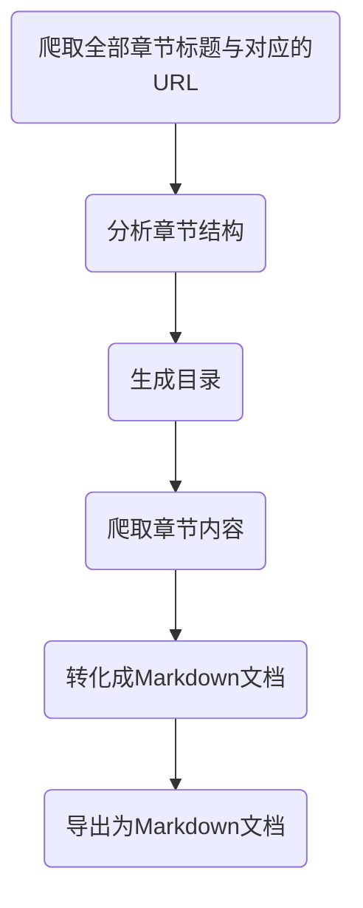
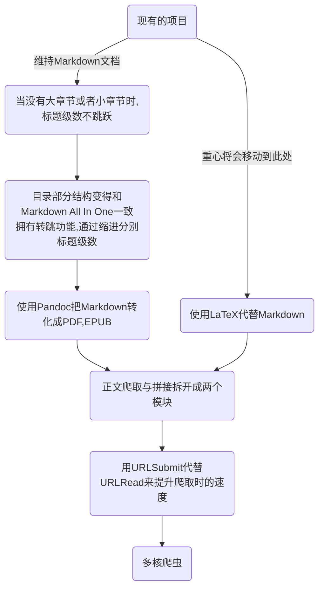

# 爬取web日轻(カクヨム上面的)并到处为排版好的文档

## 原项目
### 用于整理[Web日轻](https://kakuyomu.jp/)成Markdown文档 
   * ``新添加的功能:`` 
      1. 添加标签 
      2. 添加大章与小章的整理支持 
      3. 添加文档生成的时间 
      4. 解决换行问题 
      5. 解决如果小说书名中出现不能在文件名里面出现的字符的问题 
   * ``未来打算完成的事情:`` 
      * [ ] 正文整理部分,把爬虫与Markdown文档生成的代码拆成两部分,以方便进行并行化处理 
      * [ ] 爬虫的速度提升 
         参考[知乎专栏](https://zhuanlan.zhihu.com/p/35359905) 
         注:上面专栏的源代码链接应该改成[这个](https://github.com/uupers/BiliSpider/blob/95c07da2f7abf4f318dc41dff8e6dd891045b799/%E6%9E%81%E9%80%9F%E8%A7%86%E9%A2%91%E7%88%AC%E8%99%AB2.2.nb) 
   * ``注意:`` 
      因为是根据[妹と学園のアイドルを抱き枕代わりにして寝ていたらいつの間にか惚れられていた](https://kakuyomu.jp/works/1177354054893622559)这本书的结构完成的代码,所以无法适应全部的格式 
      已知的一些bug: 
      * [x] 遇到有章节的小说无法整理出章节,例如[兄を道連れに転生した妹は、兄妹婚を目指すようです](https://kakuyomu.jp/works/1177354054888616069)(这书是目前为止看到的章节结构最复杂的了) 
      这是那本书的目录样子: 
       
      * [x] 奇怪的换行(其实这bug一直有,只是其中一部分情况被用字符串替代换掉了) 
      
      * [x] 小说名里面有不能出现在文件名里面的字符 
       

## 目前的结构

## 未来的计划

